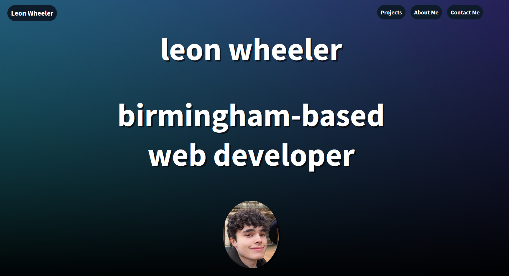
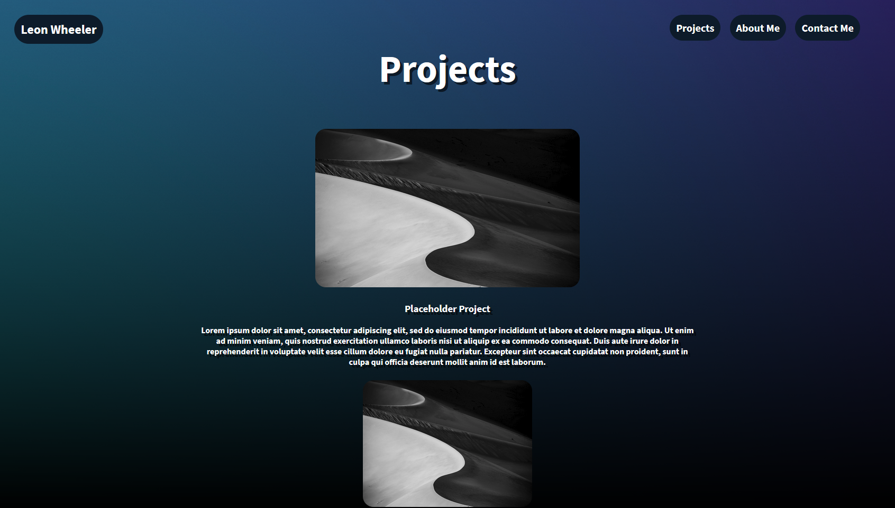
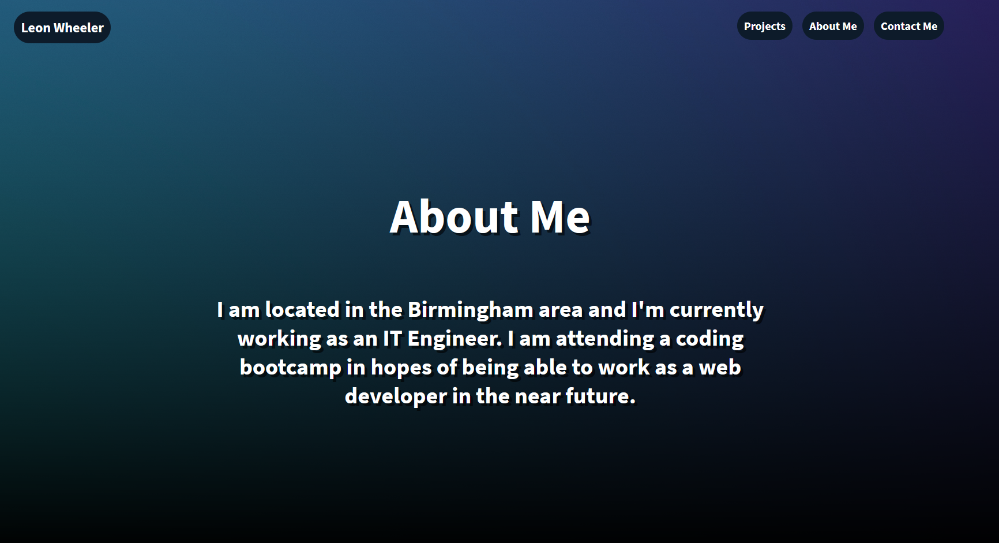
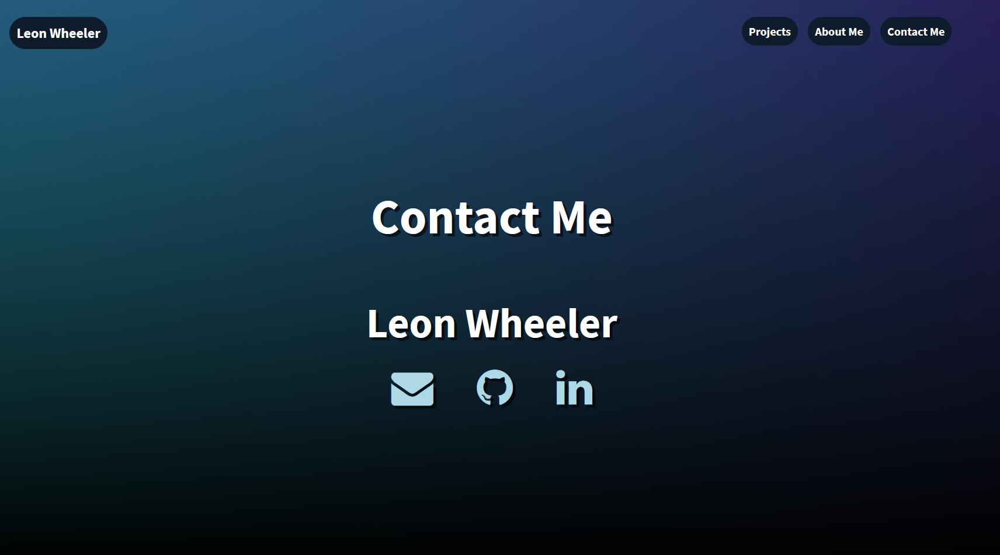

# Personal Portfolio - HW02

## Description

This is my submission for the second week homework. It is my personal portfolio created with HTML and CSS.

The site features the below:

- A landing page with my name and picture.
- A project page with placeholder images as I don't have any to showcase yet.
- An about me page with a short description of me.
- A contact page with my email, github, and linkedin.

Some of the technical features:

- Semantic HTML elements
- Linking to an external stylesheet
- Linking to google fonts and font awesome icons
- Flexbox
- Media queries for different device views
- Alt attributes for images

## Screenshots

Landing page:

Projects page:

About me page:

Contact me page:

## Project Github Pages Link

[Deployed GitHub Pages Site](https://leon3005.github.io/Personal_Portfolio/)
